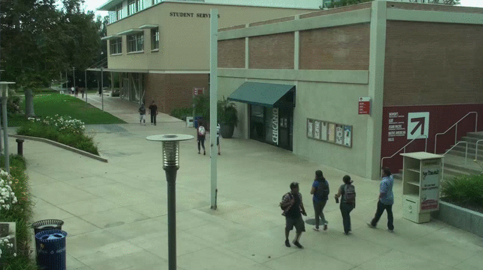
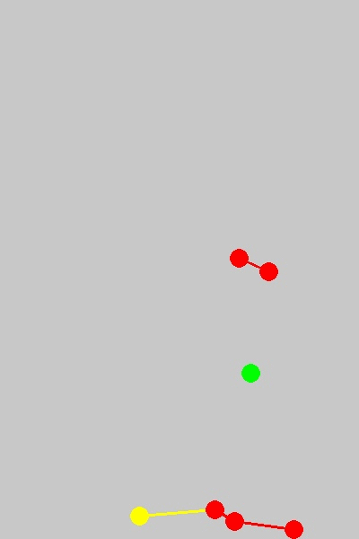

# Social Distancing AI

Tool to monitor social distancing from CCTV, videos using Python, Computer Vision. This tool can
automatically estimate interpersonal distance from uncalibrated RGB cameras. Can be used at public places and workplace.

This tool has following features:

- Detect humans in the frame with yolov3.
- Calculates the distance between every human who is detected in the frame.
- Shows how many people are at High, Low and Not at risk.

## Demo:

## Requirements:

    For human detection:
    yolov3.weights, yolov3.cfg files (weights file in not present because of size issue. It can be downloaded from
    here : https://pjreddie.com/media/files/yolov3.weights)

## File Structure:

    main.py     : Detects and calculates distance between humans
    utills.py   : Contain functions to calculate distance, scale, transformed points
    plot.py     : Contain functions to draw bird eye view and frame
    models      : Contain yolo weights and cfg.(IMPT NOTE: weights file is not present because of size issue.
                  It can be downloaded from here : https://pjreddie.com/media/files/yolov3.weights)
    data        : Contain video sample
    output      : Contain output frames

## Usage:

     * If following same directory structure
         python main.py
     * If paths for models, input video is different then given directory structure
         python main.py --model='model path' --video_path='path to video file' --output_dir='output directory' --output_vid='output vid directory'

## How it works:

     * Run following command
         python main.py

     * You will get a frame where you can draw ROI and distance scale. It will take 8 points on first frame using mouse click
       event. First four points will define ROI where we want to monitor social distancing. Also these points should form
       parallel lines in real world if seen from above(birds eye view). Next 3 points will define 6 feet(unit length)
       distance in horizontal and vertical direction and those should form parallel lines with ROI. Unit length we can take
       based on choice. Points should pe in pre-defined order - bottom-left, bottom-right, top-right, top-left, point 5 and 6
       should form horizontal line and point 5 and 7 should form verticle line. Horizontal and vertical scale will be
       different. Gif below will help understand points better.

     * Distance calculation works best for ROI.

## Output:

Bird's Eye View  

Output frames

